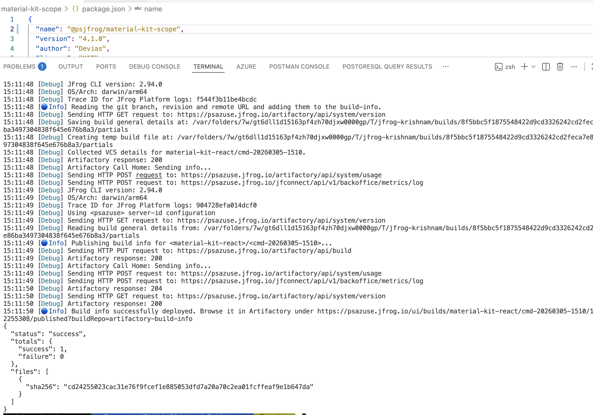
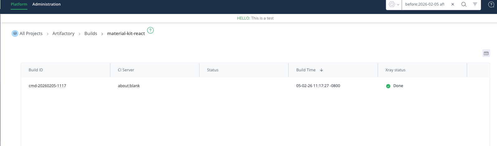
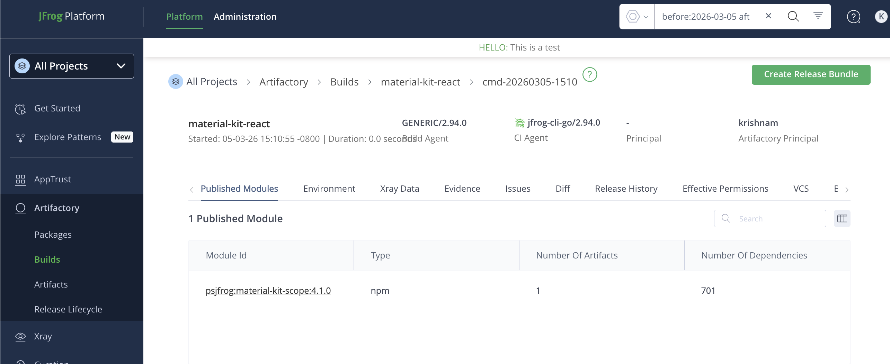
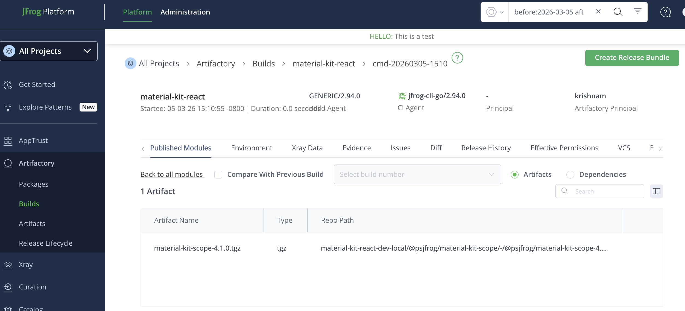

# JFrog CLI

## Build & Publish

```sh
./jfcli.sh
```








## Scoped NPM Package — No 400 Error Observed

We attempted to reproduce the issue described in [ARTIFACTORY: Installation of NPM scoped packages may return 400 errors after upgrading to version 7.98.7 and 7.98.8](https://jfrog.com/help/r/artifactory-how-to-fix-400-bad-request-issue-when-installing-npm-packages/artifactory-installation-of-npm-scoped-packages-may-return-400-errors-after-upgrading-to-version-7.98.7-and-7.98.8) but were **unable to reproduce** it on either Artifactory **7.125.6** or **7.133.6**.

### Using JFrog CLI

The scoped package `@psjfrog/material-kit-scope` was built, published, and deployed successfully via `jf npm publish` with no `400 Bad Request` errors. Full output is available in [jfcli_run_success_output.md](jfcli_run_success_output.md).

### Using npm Directly (Without JFrog CLI)

A minimal scoped package (`@cms/artifactory-npm-scope-test`) was also published directly using `npm publish` — the operation completed successfully with an HTTP `201` response, confirming the encoded scope path (`@cms%2fartifactory-npm-scope-test`) is handled correctly. Detailed steps are documented in [steps_to_test_without_jfcli_also_works.md](steps_to_test_without_jfcli_also_works.md).